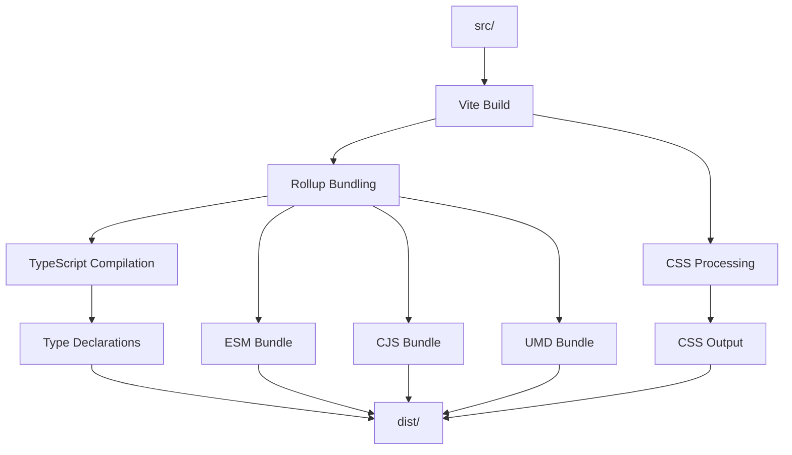

# Arquitectura Actual

## Tabla de Contenidos

- [Estructura del Proyecto](#estructura-del-proyecto)
- [Tipo de Proyecto](#tipo-de-proyecto)
- [Stack Tecnológico](#stack-tecnológico)
- [Patrones de Arquitectura](#patrones-de-arquitectura)
- [Flujo de Build](#flujo-de-build)
- [Sistema de Estilos](#sistema-de-estilos)

---

## Estructura del Proyecto

```
lola-framework-ui-test/
│
├── 📂 src/
│   ├── 📂 components/         # 24 componentes UI reutilizables
│   │   ├── Button.tsx
│   │   ├── Layout.tsx
│   │   ├── InputField.tsx
│   │   ├── Navbar.tsx
│   │   └── ... (20 más)
│   │
│   ├── 📂 hooks/              # 8 custom hooks
│   │   ├── useTheme.ts        # Sistema de theming dinámico
│   │   ├── useBlockScroll.ts
│   │   ├── useKeyboardVisible.ts
│   │   └── ... (5 más)
│   │
│   ├── 📂 icons/              # Sistema de iconos
│   │   ├── icons.tsx          # 2346 líneas, 52 iconos
│   │   └── index.ts
│   │
│   ├── 📂 styles/             # Sistema de estilos CSS
│   │   ├── index.css          # 1666 líneas
│   │   └── index.ts
│   │
│   ├── 📂 demo/               # Páginas de demostración
│   │   ├── pages/             # 17 páginas demo
│   │   └── components/        # Componentes específicos de demo
│   │
│   ├── 📂 store/              # Manejo de estado
│   │   ├── GradientSync.tsx
│   │   ├── LocalGradientProvider.tsx
│   │   └── useGradient.ts
│   │
│   ├── 📂 utils/              # Utilidades
│   │   ├── utils.ts           # Helpers de gradientes y formateo
│   │   └── constants.ts
│   │
│   ├── 📂 stories/            # Storybook documentation
│   │   ├── Button.stories.tsx
│   │   ├── Layout.stories.tsx
│   │   └── ... (26 stories)
│   │
│   └── 📄 index.ts            # Punto de entrada principal
│
├── 📂 dist/                   # Build output (708KB)
│   ├── index.es.js            # ESM bundle (156KB)
│   ├── index.js               # CJS bundle (103KB)
│   ├── styles.css             # Estilos compilados (30KB)
│   ├── lola-framework-ui-test.css  # Estilos (27KB) ⚠️ Duplicado
│   └── [declarations]
│
├── 📂 .storybook/             # Configuración Storybook
│   ├── main.ts
│   └── preview.tsx
│
├── 📂 demo-dist/              # Demo build
│
├── 📄 vite.config.ts          # Configuración principal de build
├── 📄 vite.demo.config.ts     # Build de demo
├── 📄 tsconfig.json           # Configuración TypeScript
├── 📄 tsconfig.build.json     # Config para build
├── 📄 eslint.config.js        # ESLint flat config
└── 📄 package.json            # Dependencias y scripts
```

---

## Tipo de Proyecto

### Librería de Componentes UI (Design System)

Lola Framework UI es una **librería de componentes React** diseñada para:

1. **Unificar la apariencia visual** de múltiples proyectos
2. **Acelerar el desarrollo** mediante componentes reutilizables
3. **Mantener consistencia** en el ecosistema de aplicaciones
4. **Facilitar el mantenimiento** centralizado de estilos

### Características del Proyecto

| Característica | Implementación |
|----------------|----------------|
| **Tipo** | Component Library + Design System |
| **Distribución** | NPM Package (público/privado) |
| **Formato** | ESM, CommonJS, UMD |
| **Arquitectura** | Microfrontend-ready |
| **Documentación** | Storybook 9.x |
| **Build Tool** | Vite 7.x |
| **Lenguaje** | TypeScript 5.8.x |

---

## Stack Tecnológico

### Core Dependencies

```json
{
  "react": "18.3.1",
  "react-dom": "18.3.1",
  "typescript": "5.8.3"
}
```

### Build & Tooling

```json
{
  "vite": "7.0.4",
  "vite-plugin-dts": "4.5.4",
  "@vitejs/plugin-react": "4.6.0"
}
```

### Animation & Effects

```json
{
  "framer-motion": "12.23.9"
}
```

### Utilities

```json
{
  "body-scroll-lock": "4.0.0-beta.0"  // ⚠️ Beta version
}
```

### Documentation

```json
{
  "storybook": "9.1.2",
  "@storybook/react-vite": "9.1.2",
  "@storybook/addon-docs": "9.1.2"
}
```

### Quality & Linting

```json
{
  "eslint": "9.30.1",
  "typescript-eslint": "8.35.1"
}
```

---

## Patrones de Arquitectura

### 1. Compound Components Pattern

Usado en componentes complejos como `Layout`:

```typescript
// Uso del patrón
<Layout background="#fff">
  <Layout.Header>
    <Navbar />
  </Layout.Header>
  
  <Layout.Content>
    {/* Contenido */}
  </Layout.Content>
  
  <Layout.Footer>
    <Button>Continue</Button>
  </Layout.Footer>
</Layout>
```

**Implementación**:
```typescript
const Layout = ({ children, ...props }) => {
  // Busca subcomponentes específicos
  const header = findChild(children, Header);
  const content = findChild(children, Content);
  const footer = findChild(children, Footer);
  
  return (
    <div>
      {header}
      {content}
      {footer}
    </div>
  );
};

Layout.Header = Header;
Layout.Content = Content;
Layout.Footer = Footer;
```

### 2. Composition Pattern

Componentes altamente componibles:

```typescript
<Button 
  variant="outline"
  size="large"
  showIcon={true}
  loading={isLoading}
  background={gradient}
>
  <GradientText>Continue</GradientText>
</Button>
```

### 3. Render Props Pattern

Usado en componentes de animación:

```typescript
<MotionWrapper>
  {(animationProps) => (
    <div {...animationProps}>
      Contenido animado
    </div>
  )}
</MotionWrapper>
```

### 4. Hook Pattern

Custom hooks para lógica reutilizable:

```typescript
// Separación de lógica de UI
const { isKeyboardOpen, viewportHeight } = useKeyboardVisible();
const { onSetTheme } = useTheme(themeConfig);
```

### 5. CSS-in-JS Híbrido

Combinación de CSS Modules y CSS Variables:

```typescript
// CSS Variables dinámicas
style={{
  '--bg': background,
  '--color': textColor
} as CSSProperties}
```

```css
/* CSS usando las variables */
.button {
  background: var(--bg);
  color: var(--color);
}
```

### 6. Barrel Exports Pattern

Exports centralizados para mejor DX:

```typescript
// src/components/index.ts
export { Button } from './Button';
export { Layout } from './Layout';
export * from './Navbar';

// src/index.ts
export * from './components';
export * from './hooks';
export * from './icons';
```

---

## Flujo de Build

### Proceso de Build



### Comandos de Build

```bash
# Build principal
npm run build

# Ejecuta:
# 1. vite build             - Genera bundles JS
# 2. tsc -p tsconfig.build  - Genera declaraciones .d.ts
# 3. cp src/styles/...      - Copia archivos CSS
# 4. cp src/hooks/...       - Copia exports de hooks
# 5. cp src/icons/...       - Copia exports de iconos
```

### Configuración de Build (vite.config.ts)

```typescript
export default defineConfig({
  plugins: [
    react(),
    dts({ insertTypesEntry: true, include: ["./src"] })
  ],
  build: {
    lib: {
      entry: "./src/index.ts",
      name: "lola-framework-ui",
      formats: ["es", "cjs", "umd"]
    },
    rollupOptions: {
      external: [
        "react",
        "react-dom",
        "body-scroll-lock",
        "framer-motion",
        "@vgs/collect-js",           // No instalado ⚠️
        "@vgs/collect-js-react",     // No instalado ⚠️
        "@react-google-maps/api"     // No instalado ⚠️
      ]
    }
  }
});
```

### Output de Build

```
dist/
├── index.es.js              # ESM (156KB)
├── index.js                 # CommonJS (103KB)
├── index.d.ts               # Type declarations
├── styles.css               # Estilos compilados (30KB)
├── lola-framework-ui-test.css  # ⚠️ Duplicado (27KB)
├── components/              # Declaration files
├── hooks/                   # Declaration files
└── icons/                   # Declaration files
```

---

## Sistema de Estilos

### Arquitectura CSS

```
Estilos Base (CSS Variables)
         ↓
  Componentes CSS
         ↓
  Utilidades CSS
         ↓
  Theming Dinámico (useTheme)
```

### CSS Variables System

```css
:root {
  /* Colors */
  --background: #f3f4f6;
  --foreground: #17171c;
  --primary: #3ee0cf;
  
  /* Spacing */
  --lola-border-radius: 20px;
  
  /* Typography */
  --lola-font-family: Manrope, sans-serif;
  
  /* Transitions */
  --lola-transition: all 0.2s ease-in-out;
  
  /* Shadows */
  --box-shadows: 2px 2px 5px rgba(0, 0, 0, 0.25);
  --shadow-card: 0 4px 24px -4px #00000080;
  --shadow-glow: 0 0 40px -8px #3ee0cf66;
}

@media (prefers-color-scheme: dark) {
  :root {
    --background: #09090b;
    --foreground: #fafafa;
    /* ... más overrides */
  }
}
```

### Clases de Utilidad

```css
/* Gradients */
.gradient-card { background: var(--gradient-card); }
.gradient-accent { background: var(--gradient-accent); }

/* Shadows */
.shadow-card { box-shadow: var(--shadow-card); }
.shadow-glow { box-shadow: var(--shadow-glow); }

/* Colors */
.foreground { color: var(--foreground); }
.muted-foreground { color: var(--muted-foreground); }

/* Animations */
.animate-spin { animation: spin 1s linear infinite; }
.animate-fade { animation: fade 3s linear infinite; }
```

### Theming Dinámico

El hook `useTheme` inyecta estilos dinámicamente:

```typescript
// Uso
useTheme({
  h1: {
    weight: 600,
    min: "1.5rem",
    max: "3rem",
    lineHeight: 1.2
  },
  bodycopy: {
    weight: 400,
    min: "1rem",
    max: "1.25rem"
  }
});

// Genera en runtime:
// <style id="global-theme-styles">
//   .h1 { font-size: clamp(1.5rem, 2vw + 0.25rem, 3rem); ... }
//   .bodycopy { font-size: clamp(1rem, 1.5vw + 0.25rem, 1.25rem); ... }
// </style>
```

**⚠️ Nota**: Esta implementación tiene implicaciones de performance. Ver [Problemas Identificados](../problems/README.md#manejo-de-temas).

---

## Exports Structure

### Package.json Exports

```json
{
  "name": "lola-framework-ui-test",
  "main": "./dist/index.js",
  "module": "./dist/index.es.js",
  "types": "dist/index.d.ts",
  "styles": "dist/styles/index.d.ts",
  "hooks": "dist/hooks/index.d.ts",
  "icons": "dist/icons/index.d.ts"
}
```

### Uso en Proyectos Consumidores

```typescript
// Importar componentes
import { Button, Layout } from 'lola-framework-ui-test';

// Importar estilos
import 'lola-framework-ui-test/src/styles';

// Importar iconos
import { IconApp } from 'lola-framework-ui-test/src/icons';

// Importar hooks
import { useKeyboardVisible } from 'lola-framework-ui-test/src/hooks';
```

**⚠️ Problema**: Los paths actuales no están optimizados. Ver [Propuesta de Modernización](../modernization/README.md#exports-condicionales).

---

## Decisiones Arquitecturales Clave

### ✅ Buenas Decisiones

1. **Peer Dependencies Flexibles**: Soporta React 18 y 19
2. **TypeScript Strict Mode**: Mejor type safety
3. **Storybook para Docs**: Documentación interactiva
4. **CSS Variables**: Theming flexible
5. **Vite 7**: Build tool moderno y rápido

### ⚠️ Áreas de Mejora

1. **Iconos Monolíticos**: Sin tree-shaking
2. **CSS Duplicado**: Dos archivos CSS idénticos
3. **Dependencias Externas**: No instaladas pero referenciadas
4. **Build Process Manual**: Post-build copy scripts
5. **Sin Code Splitting**: Todo en un bundle

---

## Diagrama de Dependencias

```
lola-framework-ui-test
├── React (peer)
│   └── react-dom (peer)
├── framer-motion
│   └── @emotion/is-prop-valid
├── body-scroll-lock ⚠️ beta
├── TypeScript (dev)
├── Vite (dev)
│   ├── @vitejs/plugin-react
│   └── vite-plugin-dts
└── Storybook (dev)
    └── @storybook/react-vite

Dependencias NO INSTALADAS:
├── @vgs/collect-js ⚠️
├── @vgs/collect-js-react ⚠️
└── @react-google-maps/api ⚠️
```

---

## Próximos Pasos

1. [Revisar Dependencias →](../dependencies/README.md)
2. [Explorar Componentes →](../components/README.md)
3. [Identificar Problemas →](../problems/README.md)

---

[← Volver al Índice](../README.md)
